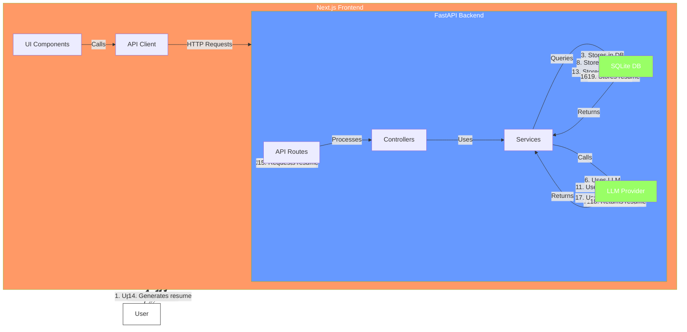
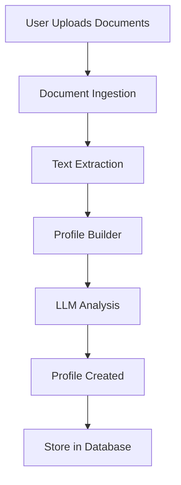
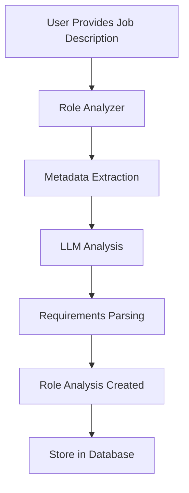
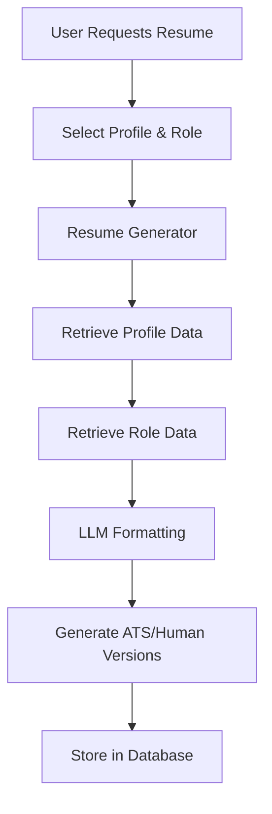
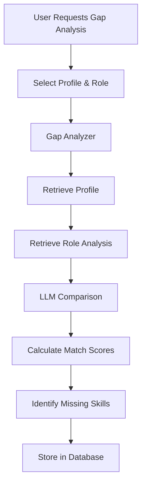
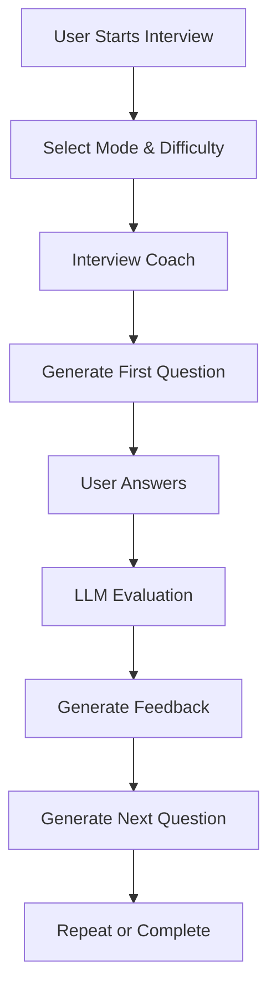
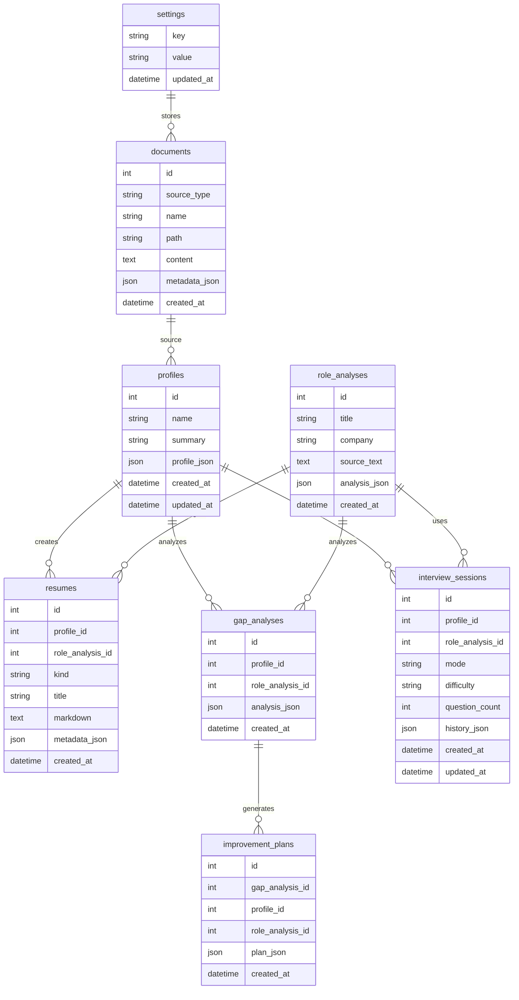
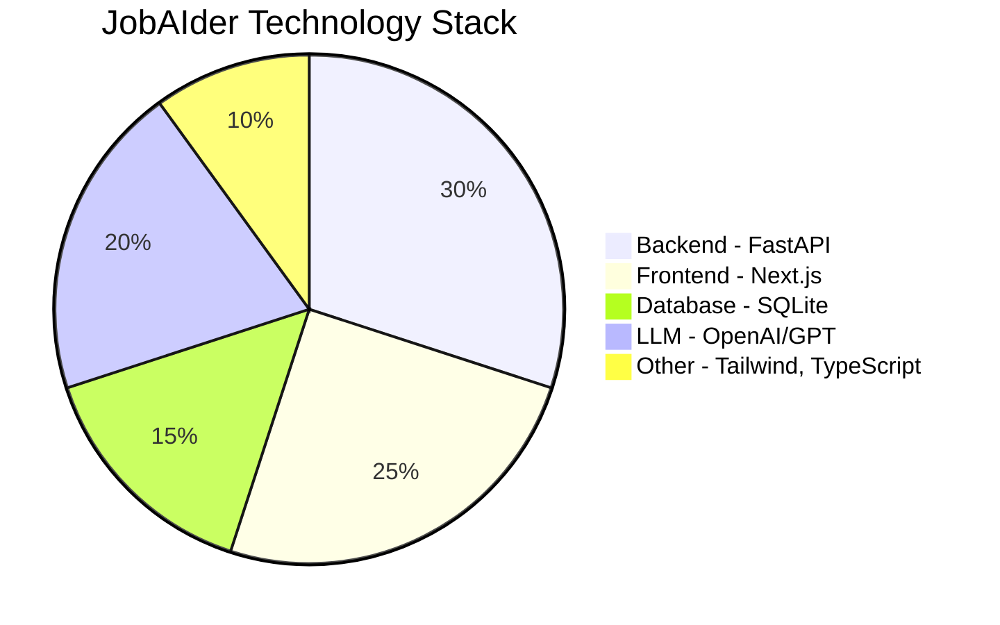

# JobAIder - Complete Repository Architecture

## Repository Structure Overview

```mermaid
graph TD
    %% Main Directories
    A[JobAIder Repository] --> B[backend]
    A --> C[frontend]
    A --> D[docs]
    A --> E[Jobs]
    A --> F[logs]
    A --> G[Root Files]
    
    %% Backend Structure
    subgraph Backend[backend/]
        B1[app/] --> B
        B2[__pycache__/] --> B
    end
    
    subgraph BackendApp[app/]
        BA1[main.py] --> B1
        BA2[schemas.py] --> B1
        BA3[db.py] --> B1
        BA4[__init__.py] --> B1
        
        BA5[core/] --> B1
        BA6[modules/] --> B1
    end
    
    subgraph Core[core/]
        C1[config.py] --> BA5
        C2[__init__.py] --> BA5
    end
    
    subgraph Modules[modules/]
        M1[profile_builder.py] --> BA6
        M2[role_analyzer.py] --> BA6
        M3[resume_generator.py] --> BA6
        M4[gap_analyzer.py] --> BA6
        M5[interview_coach.py] --> BA6
        M6[improvement_planner.py] --> BA6
        M7[document_ingestion.py] --> BA6
        M8[obsidian_parser.py] --> BA6
        M9[llm_provider.py] --> BA6
        M10[__init__.py] --> BA6
    end
    
    %% Frontend Structure
    subgraph Frontend[frontend/]
        F1[app/] --> C
        F2[components/] --> C
        F3[lib/] --> C
        F4[public/] --> C
        F5[node_modules/] --> C
        F6[.next/] --> C
        F7[Config Files] --> C
    end
    
    subgraph FrontendApp[app/]
        FA1[dashboard/] --> F1
        FA2[gap-analysis/] --> F1
        FA3[improvement-plan/] --> F1
        FA4[interview-prep/] --> F1
        FA5[resume-editor/] --> F1
        FA6[resume-studio/] --> F1
        FA7[role-analysis/] --> F1
        FA8[settings/] --> F1
        FA9[user-profile/] --> F1
        FA10[layout.tsx] --> F1
        FA11[page.tsx] --> F1
        FA12[globals.css] --> F1
    end
    
    subgraph FrontendComponents[components/]
        FC1[app-shell.tsx] --> F2
        FC2[page-header.tsx] --> F2
        FC3[resume-context-panel.tsx] --> F2
        FC4[status-panel.tsx] --> F2
        FC5[saved-selectors.tsx] --> F2
        FC6[providers.tsx] --> F2
        FC7[ui/] --> F2
    end
    
    subgraph FrontendLib[lib/]
        FL1[api.ts] --> F3
        FL2[utils.ts] --> F3
    end
    
    subgraph FrontendUI[ui/]
        FU1[button.tsx] --> FC7
        FU2[card.tsx] --> FC7
        FU3[input.tsx] --> FC7
        FU4[select.tsx] --> FC7
        FU5[textarea.tsx] --> FC7
    end
    
    %% Other Directories
    subgraph Documentation[docs/]
        D1[*.md files] --> D
    end
    
    subgraph Jobs[Jobs/]
        J1[Job files] --> E
    end
    
    subgraph Logs[logs/]
        L1[Log files] --> F
    end
    
    %% Root Files
    subgraph RootFiles[Root Files]
        RF1[README.md] --> G
        RF2[ats-resume.md] --> G
        RF3[human-friendly-resume.md] --> G
        RF4[tailored-resume.md] --> G
        RF5[jobradar.db] --> G
        RF6[.gitignore] --> G
        RF7[CLAUDE.md] --> G
    end

    %% Key Relationships
    BA1 -->|imports| BA2
    BA1 -->|imports| BA3
    BA1 -->|imports| BA6
    
    BA6 -->|contains| M1
    BA6 -->|contains| M2
    BA6 -->|contains| M3
    BA6 -->|contains| M4
    BA6 -->|contains| M5
    BA6 -->|contains| M6
    BA6 -->|contains| M7
    BA6 -->|contains| M8
    BA6 -->|contains| M9
    
    F1 -->|uses| F2
    F1 -->|uses| F3
    F3 -->|calls| BA1

    %% Styling
    classDef directory fill:#bbf,stroke:#333,stroke-width:2px;
    classDef file fill:#9f9,stroke:#333,stroke-width:1px;
    classDef module fill:#f9f,stroke:#333,stroke-width:1px;
    
    class A,G directory
    class B,C,D,E,F directory
    class B1,B2,BA1,BA2,BA3,BA4,BA5,BA6 directory
    class BA1,BA2,BA3,BA4 file
    class C1,C2,M1,M2,M3,M4,M5,M6,M7,M8,M9,M10 file
    class F1,F2,F3,F4,F5,F6,F7 directory
    class FA1,FA2,FA3,FA4,FA5,FA6,FA7,FA8,FA9,FA10,FA11,FA12 file
    class FC1,FC2,FC3,FC4,FC5,FC6,FC7 directory
    class FL1,FL2 file
    class FC7 directory
    class FU1,FU2,FU3,FU4,FU5 file
    class D1,J1,L1,RF1,RF2,RF3,RF4,RF5,RF6,RF7 file
```

## Detailed Component Breakdown

### Data Flow Diagram

## Key Features and Workflows

### 1. Profile Building Workflow

### 2. Role Analysis Workflow

### 3. Resume Generation Workflow

### 4. Gap Analysis Workflow

### 5. Interview Preparation Workflow

## Database Schema

## Technology Stack

## Summary

This comprehensive architecture documentation covers:

1. **Repository Structure**: Complete file and directory hierarchy
2. **Backend Architecture**: Class diagram of all modules and their relationships
3. **Frontend Architecture**: Component structure and page relationships
4. **Data Flow**: How data moves through the system
5. **Workflows**: Detailed process flows for each major feature
6. **Database Schema**: Entity-relationship diagram of all tables
7. **Technology Stack**: Visual breakdown of technologies used

The Mermaid diagrams provide interactive visualizations that can be viewed in any Mermaid-compatible viewer.
